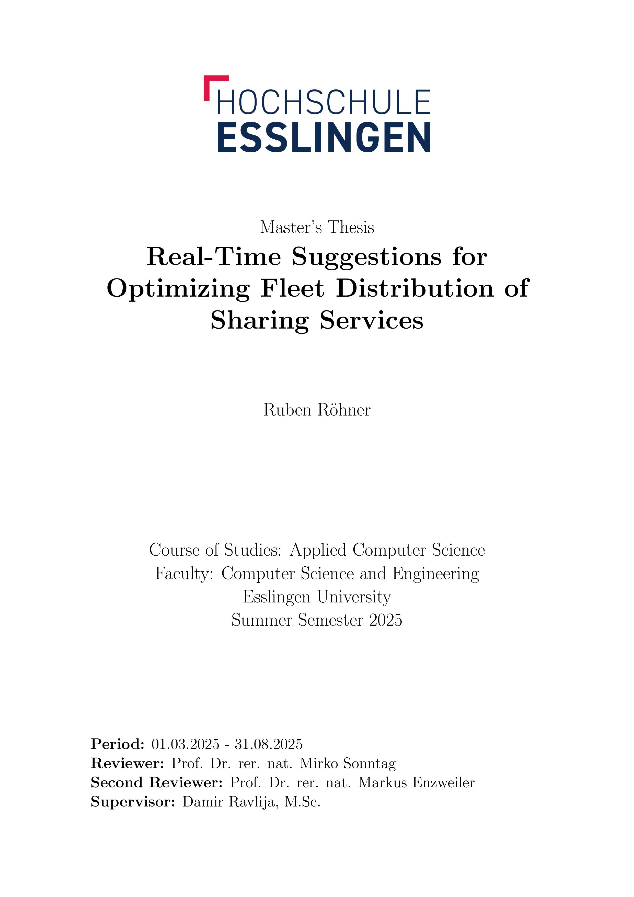

# Real-Time Suggestions for Optimizing Fleet Distribution of Sharing Services

**M.Sc. Thesis · Hochschule Esslingen · 2025**

This repository contains the LaTeX source and compiled PDF of my Master's Thesis on dynamic fleet rebalancing for shared-micromobility services using hierarchical reinforcement learning. The thesis covers the full research context — related work, problem formulation, detailed architecture design, experimental methodology, and discussion of results — complementing the [code framework](https://github.com/rubenRoehner/masterthesis_rebalancing_framework) which contains the implementation.

## 📄 Read the thesis

[](./masterthesis_roehner_final.pdf)

→ **[Download PDF](./masterthesis_roehner_final.pdf)**

## Abstract

Shared micromobility services have experienced a significant rise in popularity, leading to increased usage, which has resulted in challenges regarding service quality. Due to the distinct usage patterns of such services, fleet imbalances occur, which decrease the quality of services and require a dynamic rebalancing strategy. This thesis proposes a novel Hierarchical Reinforcement Learning (HRL) framework to address these challenges. The framework decomposes the problem into two tiers: a high-level Regional Distribution Coordinator (RDC) for operator-based rebalancing and a set of low-level User-Incentive Coordinators (UICs) for user-based incentives. The high-level RDC focuses on strategic movements that address imbalances over the whole service area, while the UIC agents address local imbalances.

The framework was evaluated in a custom simulation environment against multiple baselines. The results demonstrate that the high-level RDC agent of the HRL approach increased the Satisfied Demand Ratio (SDR) by 7.5% over the No-Rebalancing baseline while maintaining efficient use of rebalancing resources. Counterintuitively, the combined HRL framework yielded slightly worse results, indicating improper coordination between the two levels of agents, which could be addressed in future work.

## Related

- **Code framework:** [`masterthesis_rebalancing_framework`](https://github.com/rubenRoehner/masterthesis_rebalancing_framework) — full implementation, simulation environment, and training pipelines.

## Citation

If you reference this work, please cite:

```bibtex
@mastersthesis{roehnerHRL2025,
    author  = {Ruben Röhner},
    title   = {Real-Time Suggestions for Optimizing Fleet Distribution of Sharing Services},
    school  = {Esslingen University},
    year    = {2025},
    month   = {August},
    type    = {Master's Thesis}
}
```

## License

See [LICENSE](./LICENSE) for license terms.
